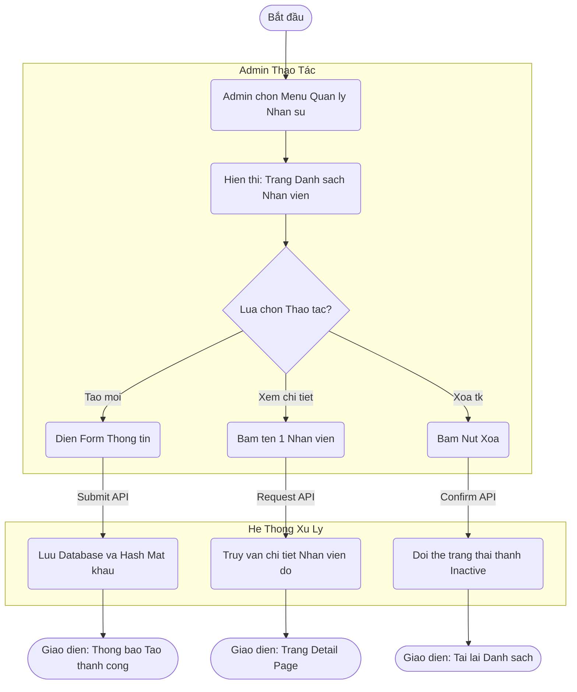
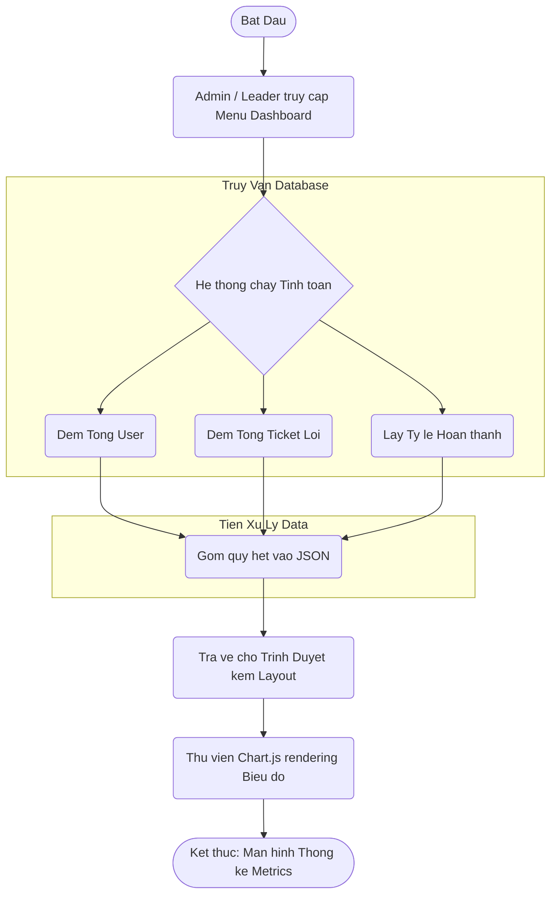
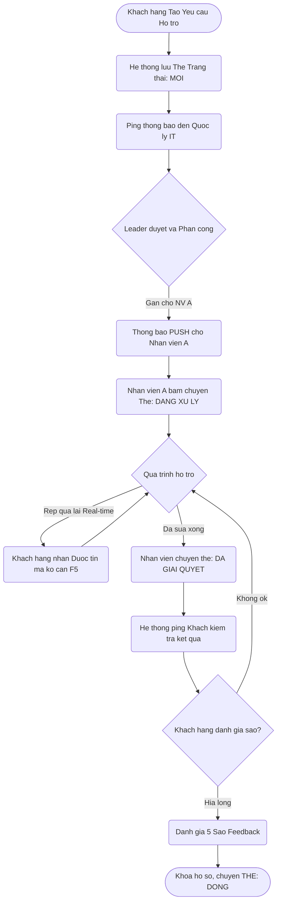

# BỘ GIÁO DỤC VÀ ĐÀO TẠO
# TRƯỜNG ĐẠI HỌC CÔNG NGHỆ KỸ THUẬT TP. HỒ CHÍ MINH
## KHOA CÔNG NGHỆ THÔNG TIN

---

**MÔN HỌC:** CÔNG NGHỆ PHẦN MỀM  
**ĐỀ TÀI:** Hệ thống quản lý yêu cầu hỗ trợ kỹ thuật (IT Ticket Management System - IT-TMS)  
**(NHÓM 0000)**  

**Nhóm sinh viên thực hiện:**  
- SV1: 00000000  
- SV2: 00000000  
- SV3: 00000000  

**TP. Hồ Chí Minh - [Tháng/Năm]**

---

# MỤC LỤC
- [LỜI CẢM ƠN](#lời-cảm-ơn)
- [PHẦN 1: PHÂN TÍCH YÊU CẦU](#phần-1-phân-tích-yêu-cầu)
- [PHẦN 2: THIẾT KẾ UML & LUỒNG NGHIỆP VỤ](#phần-2-thiết-kế-uml--luồng-nghiệp-vụ)
- [PHẦN 3: CÀI ĐẶT HỆ THỐNG](#phần-3-cài-đặt-hệ-thống)
- [PHẦN 4: KIỂM THỬ VÀ DEMO](#phần-4-kiểm-thử-và-demo)
- [PHẦN 5: TRIỂN KHAI VÀ KẾT LUẬN](#phần-5-triển-khai-và-kết-luận)

---

# LỜI CẢM ƠN
Trong quá trình thực hiện bài báo cáo nhóm học phần Công nghệ phần mềm với đề tài **Hệ thống quản lý yêu cầu hỗ trợ kỹ thuật từ người dùng (IT-TMS)**, nhóm chúng em đã nhận được sự quan tâm, hướng dẫn tận tình từ giảng viên. Những kiến thức chuyên môn cùng với sự hướng dẫn chi tiết của thầy/cô đã giúp nhóm chúng em có định hướng đúng đắn trong quá trình phân tích, xây dựng mô hình hóa, và hoàn thiện cấu trúc quy trình theo chuẩn học thuật của bộ môn.

Nhóm chúng em xin chân thành cảm ơn!

---

# PHẦN 1: PHÂN TÍCH YÊU CẦU

## 1.1. Xác định yêu cầu các chức năng chính
Hệ thống IT-TMS cung cấp giải pháp số hóa quy trình tiếp nhận và xử lý sự cố. Các chức năng chính bao gồm:
- **Quản lý Tài khoản (User CRUD):** Khởi tạo, xem danh sách, cập nhật thông tin phòng ban, gán quyền (Role) và khóa tài khoản nhân sự.
- **Quản lý Yêu cầu (Ticket Issue):** Người dùng có thể khởi tạo Ticket (kèm tiêu đề, mô tả, đính kèm file). Hệ thống định tuyến Ticket đến các bộ phận có chẩm quyền.
- **Điều phối và Xử lý (Assignment & Resolve):** Quản lý điều phối Ticket cho các Kỹ thuật viên (Staff). Kỹ thuật viên cập nhật thay đổi trạng thái tiến độ (Mới -> Đang xử lý -> Giải quyết xong).
- **Giao tiếp thời gian thực (Real-time Messaging):** Hỗ trợ trao đổi, chat 2 chiều giữa Kỹ thuật viên và Người báo lỗi ngay trong Ticket bằng cơ chế AJAX Polling. Kèm theo Ghi chú nội bộ cho riêng Kỹ thuật viên.
- **Thống kê và Báo cáo (Dashboard):** Tổng hợp số lượng Ticket, trạng thái hoàn thành và KPI đo lường đánh giá chất lượng bằng biểu đồ trực quan.

## 1.2. Xác định các yêu cầu phi chức năng
Bên cạnh chức năng, phần mềm cần đáp ứng các điều kiện sau:
- **Hiệu năng và Tương tác (UX/UI):** Tốc độ phản hồi giao diện nhanh, tương tác trao đổi tin nhắn trực tiếp không cần F5 tải lại trang. Hỗ trợ hiển thị trên đa thiết bị di động (Responsive).
- **Bảo mật (Security):** Mật khẩu người dùng bắt buộc mã hóa chuẩn Hash (scrypt/pbkdf2). Phân quyền chặt chẽ từng Routes (Ví dụ: User không thể truy cập giao diện của Admin).
- **Theo dõi vết (Audit Log):** Mọi hành động nhạy cảm (Đăng nhập, thêm/sửa/xóa user, đổi trạng thái) phải được máy chủ sinh ra System Log ghi nhận lại IP và thời gian.

## 1.3. Phân vai Actor
Hệ thống định tuyến cho 4 Actor cốt lõi:
1. **Khách hàng / Nhân viên (User):** Người sử dụng cuối, truy cập để báo cáo lỗi máy móc/phần mềm hoặc xin cấp phát tài nguyên IT. Đánh giá chất lượng hỗ trợ (Rating).
2. **Kỹ thuật viên (Staff):** Người trực tiếp nhận việc, tiến hành sửa chữa, báo cáo tiến độ và hướng dẫn Khách hàng thông qua hệ thống tin nhắn.
3. **Quản lý (Leader):** Tổ trưởng IT, có quyền cao bao quát được tình hình các Ticket, thực hiện gán (Assign) phiếu lỗi cho Kỹ thuật viên thích hợp dựa trên hiệu suất thống kê.
4. **Quản trị viên (Admin):** Nắm quyền tối cao, trực tiếp thao tác Database chuẩn hóa Người dùng (thêm, sửa, xóa, cấp quyền), theo dõi Server Log và Dashboard tổng.

---

# PHẦN 2: THIẾT KẾ UML & LUỒNG NGHIỆP VỤ

## 2.1. Luồng nghiệp vụ 1: CRUD Quản lý Nhân sự (Listing & Detail page)
*Sơ đồ thể hiện chuỗi tương tác (Flowchart) khi Admin quản lý tài khoản User thông qua 2 màn hình: Trang danh sách (Listing) và Chi tiết/Thêm mới (Detail).*

## 2.2. Luồng nghiệp vụ 2: Trang Dashboard thống kê thông tin
*Sơ đồ hướng dữ liệu cho thấy quá trình gom nhóm số liệu từ nhiều Table khác nhau về chung một Chart.*

## 2.3. Luồng nghiệp vụ 3 (Đặc thù): Khách tạo Yêu cầu -> Leader duyệt -> Staff Xử lý
*Đây là luồng nghiệp vụ cốt lõi nhất mang lại giá trị cho ứng dụng giải quyết sự cố (tương đồng với luồng Đăng ký nghỉ/Duyệt phép).*

## 2.4. Các luồng nghiệp vụ mở rộng (Hỗ trợ luồng cốt lõi số 3)

### Tình huống phụ A: Xử lý Ticket giả mạo (Reject Flow)
- Thay vì Leader phân công (Assign) Ticket cho Staff ở bước D, nếu Leader phát hiện Khách hàng lên Ticket đùa giỡn, hoặc trùng lặp (Duplicate), Leader có quyền bấm Node **Từ chối (Reject)**.
- Khi đó, hệ thống văng Pop-up bắt Leader nhập dòng lý do. Mũi tên của lưu đồ đâm thẳng về mốc [Chuyển Thẻ: TỪ CHỐI] và gửi mail ngược lại cho User báo hủy Ticket.

### Tình huống phụ B: Tự động đóng (Auto-Closing Rule)
- Ở Node J, nếu Hệ thống báo Khách kiểm tra kết quả (Ticket đã RESOLVED do Staff báo hoàn thành), nếu trong vòng 7 ngày User / Khách hàng không chịu phản hồi xác nhận, hệ thống Trigger Job sẽ tự động trượt mũi tên về đích: Đóng tài liệu (Closed) vĩnh viễn không cần qua Feedback.

---

# PHẦN 3: CÀI ĐẶT
Nền tảng sử dụng kiến trúc MVC với hệ quản trị CSDL SQLite (được ánh xạ bằng Flask-SQLAlchemy).

**Các Module cài đặt:**
- `models.py`: Định nghĩa cấu trúc các Entity (Lớp đối tượng) tương thích với biểu đồ Class Diagram. Bao gồm: User, Ticket, Comment, TicketStatus...
- `routes/auth.py`: Chịu trách nhiệm bảo mật và Luồng Authentication (Đăng nhập, session).
- `routes/admin.py`, `routes/user.py`, `...`: Phân mảng Controller cho từng Actor tương ứng.
- `templates/...`: Lớp View hiển thị xử lý DOM linh hoạt bằng Jinja2 Template và Bootstrap/Tailwind.

**Quy trình Sprint:**
- **Sprint 1:** Phát triển Cấu trúc Model, xây dựng luồng User có khả năng Login và Tạo Ticket. Đổ dữ liệu mẫu (Seed Data).
- **Sprint 2:** Xây dựng luồng Thống kê (Leader/Admin), Luồng Comment bằng Polling AJAX (Tickers 3s update), Triển khai Cập nhật Status động cho Kỹ thuật viên.

---

# PHẦN 4: KIỂM THỬ VÀ DEMO

*(Chèn các hình ảnh Screenshot quá trình Test thực tế giao diện ở đây)*

1. **Test Case 1: Đăng nhập thành công và định tuyến**
   > Kiểm tra hệ thống nhận diện Actor (User, Staff...) đưa về đúng Dashboard chuyên biệt.
   > *(Chèn Hình giao diện đăng nhập)*

2. **Test Case 2: Flow tạo Ticket và Phân công (Luồng 3)**
   > Khách hàng upload form đi kèm ảnh báo lỗi. Trưởng phòng IT nhận được thấy danh sách, và thả thả chuột Assign cho Kỹ thuật viên A.
   > *(Chèn Hình giao diện Tạo Form và Bảng Phân công Leader)*

3. **Test Case 3: Flow Chat cập nhật Không F5 (AJAX)**
   > Hai Tab độc lập (Một tài khoản User, một của Staff), khi bấm gửi tin nhắn, bong bóng Chat nổi lên cùng thời điểm nhờ Polling Loop 3s.
   > *(Chèn Hình Khung bình luận Real-Time trong View Chi Tiết Ticket)*

4. **Test Case 4: Flow báo cáo Dashboard (Luồng 2)**
   > Quản trị viên thay đổi Select Box (7 Ngày, 30 Ngày qua), Biểu diễn tỷ lệ Trạng thái (New/Closed/Resolved) trên biểu đồ tròn Chart.js tự động thay đổi lát cắt theo chuẩn. 
   > *(Chèn Hình giao diện Chart.js hiển thị màu sắc KPI)*

---

# PHẦN 5: TRIỂN KHAI VÀ KẾT LUẬN

Hệ thống **IT Ticket Management System (IT-TMS)** được xây dựng trọn vẹn từ tư duy phân tích Luồng Nghiệp vụ (Business Process) cho đến thiết kế định tuyến (Routes Controller). 

Kết quả đã đạt được những mục tiêu của môn Tiên quyết lập trình web ứng dụng trong thiết kế kỹ thuật phần mềm:
- Hiện thực hóa thành công các luồng nghiệp vụ bắt buộc: Quản trị CRUD tập trung, Thống kê hiệu năng đo lường nhân viên.
- Số hóa quy trình Phân công gán việc (Assign) linh hoạt dựa trên Workflow trạng thái rõ ràng (TickeStatus Table).
- Hiệu suất tốt nhờ vận dụng kịch bản Front-end thông minh (Không cần tải trang cho tin nhắn, mã hoá Data cho Biểu đồ thống kê).

Hệ thống đã sẵn sàng cho bước kiểm thử hộp đen chuẩn Quốc tế trước khi được cấu hình Docker/WSGI để mang lên Web Server thực thụ. Trong tương lai, cấu trúc ứng dụng hoàn toàn có thể Scale-up thêm Module Chấm công hoặc Check-in thiết bị theo chuẩn doanh nghiệp.

---
*(Hết Báo cáo)*
